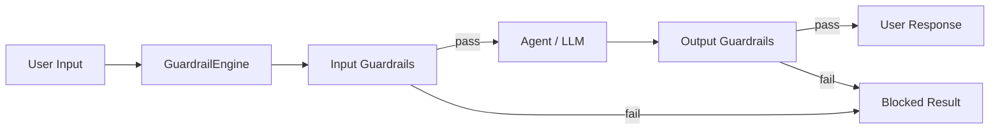

# agent-guardrails

`agent-guardrails` is a lightweight plug-and-play guardrail framework for AI agents. It gives you a small, composable way to validate inputs and outputs before they reach your model or your user.

## Features

- Input guardrails for empty input, blocked keywords, PII, prompt injection, and max length
- Output guardrails for sensitive data, toxicity classification, and max length
- Provider abstraction for LLM-backed checks
- Simple engine with first-failure blocking
- Structured results and reusable logging
- Type-hinted, small, production-oriented Python code

## Installation

```bash
pip install agent-guardrails
```


Install directly from Bitbucket:

```bash
pip install git+https://bitbucket.org/company/agent-guardrails.git
```

## Project Overview

The package is designed for agent workflows that need lightweight policy checks without pulling in a heavy framework. You can register only the guardrails you need, run them in order, and stop at the first failure.

## Folder Structure

```text
agent_guardrails/
├── providers/
├── guardrails/
├── engine/
├── logging/
├── models/
├── __init__.py
tests/
examples/
README.md
pyproject.toml
requirements.txt
LICENSE
```

## Quick Start

```python
from agent_guardrails import GuardrailEngine, EmptyInputGuardrail, PIIDetectionGuardrail

engine = GuardrailEngine(
    input_guardrails=[EmptyInputGuardrail(), PIIDetectionGuardrail()],
)

result = engine.validate_input("Hello world")
print(result.allowed, result.reason)
```

## Input Guardrails Example

```python
from agent_guardrails import GuardrailEngine, EmptyInputGuardrail, KeywordBlockGuardrail

engine = GuardrailEngine(
    input_guardrails=[
        EmptyInputGuardrail(),
        KeywordBlockGuardrail(keywords=["forbidden", "secret"]),
    ],
)

print(engine.validate_input("Please do this."))
```

## Output Guardrails Example

```python
from agent_guardrails import GuardrailEngine, SensitiveOutputGuardrail, OutputLengthGuardrail

engine = GuardrailEngine(
    output_guardrails=[
        SensitiveOutputGuardrail(),
        OutputLengthGuardrail(max_length=500),
    ],
)

print(engine.validate_output("Here is the answer."))
```

## OpenAI Example

```python
import os

from agent_guardrails import OpenAIProvider, ToxicityGuardrail

provider = OpenAIProvider(api_key=os.environ["OPENAI_API_KEY"])
guardrail = ToxicityGuardrail(provider=provider)
print(guardrail.validate("Helpful response"))
```

## Ollama Example

```python
from agent_guardrails import OllamaProvider, ToxicityGuardrail

provider = OllamaProvider(model="llama3.1")
guardrail = ToxicityGuardrail(provider=provider)
print(guardrail.validate("Helpful response"))
```

## Logging Example

```python
from agent_guardrails.logging.logger import get_logger

logger = get_logger()
logger.info("Running PIIDetectionGuardrail")
logger.warning("PIIDetectionGuardrail blocked request")
```

## Architecture Diagram



## Running Tests

```bash
pytest
```

## Future Enhancements

- Add richer policy objects and per-guardrail configuration presets
- Expand provider support for more hosted and local model APIs
- Add structured severity levels for block reasons
- Add async provider and engine variants
- Add telemetry hooks for observability platforms

